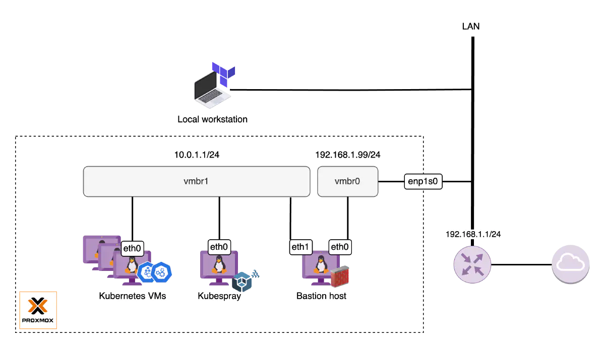

Configuring an internal network
We need to have an internal network set up beforehand. Instead of plugging Kubernetes nodes into the default Proxmox VE bridge vmbr0, I would recommend you to put all of them into a dedicated internal network. This approach offers several benefits, including improved security by isolating the cluster from the LAN network and allowing more granular control over network configurations.



To configure an internal network in Proxmox VE, follow these instructions:

1. Start a new shell session on your Proxmox VE server and switch to the Root shell if you haven’t already.
```shell
sudo -i
```

2. Take a backup of the network configuration file /etc/network/interfaces.
```shell
cp /etc/network/interfaces /etc/network/interfaces.original
```
3. Open the /etc/network/interfaces file in a text editor and append the below configuration for the new network vmbr1.
```shell
# /etc/network/interfaces
...
...
# Dedicated internal network for Kubernetes cluster
auto vmbr1
iface vmbr1 inet static
    address  10.0.1.1/24
    bridge-ports none
    bridge-stp off
    bridge-fd 0

    post-up   echo 1 > /proc/sys/net/ipv4/ip_forward
    post-up   iptables -t nat -A POSTROUTING -s '10.0.1.0/24' -o vmbr0 -j MASQUERADE
    post-down iptables -t nat -D POSTROUTING -s '10.0.1.0/24' -o vmbr0 -j MASQUERADE
```

The above configuration does the following:

Define the new network bridge vmbr1 that should be brought up during system boot.
Assign it a fixed IP address 10.0.1.1 with a subnet mask of /24. This presents a network range from 10.0.1.0 to 10.0.1.255.
Configure Masquerading (NAT) with iptables that allows any outgoing traffic (internet access) from the Kubernetes VMs can happen through vmbr0.
Execute ifreload command to apply the changes.

```shell
ifreload -a
```
If for any reason ifreload does not bring up the network, it’s worth considering a server reboot.

Please note that the given configuration is a rudimentary example. You may need to customize it further to suit your specific needs. For more information, refer to this wiki: [Proxmox network configuration](https://pve.proxmox.com/wiki/Network_Configuration)